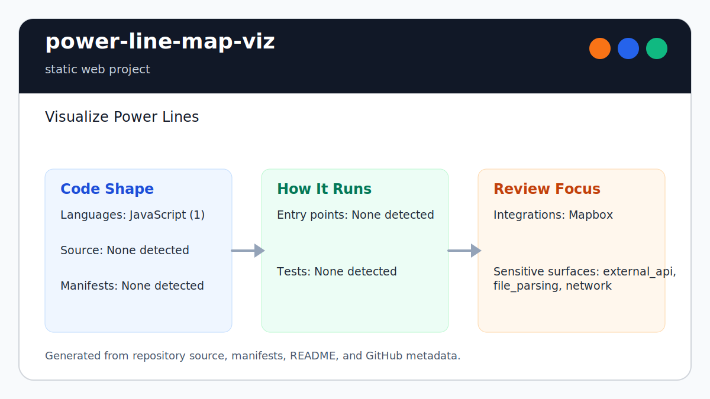

# power-line-map-viz

<!-- README-OVERVIEW-IMAGE -->


## Overview

`garethpaul/power-line-map-viz` is a static web project. Visualize Power Lines

This README is based on the checked-in source, manifests, scripts, and repository metadata on the `master` branch. The project language mix found during review was: JavaScript (1).

## Repository Contents

- `SECURITY.md` - security reporting and disclosure guidance
- `CHANGES.md` - notable maintenance changes
- `.github/workflows/check.yml` - hosted no-install map contract validation
- `Makefile` - local verification entry points
- `DATASETS.md` - dataset provenance, freshness, and handling notes
- `geojson` - local infrastructure datasets, stored as GeoJSON or Git LFS pointers
- `images` - marker and map image assets
- `docs/plans` - canonical completed maintenance plans
- `plans` - completed maintenance plans
- `scripts` - deterministic map asset validation checks
- `VISION.md` - project direction and maintenance guardrails

Additional scan context:

- Source directories: geojson, images, scripts
- Dependency and build manifests: Makefile
- Entry points or build surfaces: index.html, map-script.js, Makefile
- Test-looking files: scripts/check-map-assets.js

## Getting Started

### Prerequisites

- Git
- Node.js and `make`
- Git LFS if you need hydrated GeoJSON data instead of pointer files

### Setup

```bash
git clone https://github.com/garethpaul/power-line-map-viz.git
cd power-line-map-viz
```

The setup commands above are derived from repository files. Legacy mobile, Python, or JavaScript samples may require older SDKs or package versions than a modern workstation uses by default.

## Running or Using the Project

- Open `index.html` in a browser or serve the directory with a static file server.
- The checked-in page shows a browser warning until a Mapbox token is configured.
- Missing marker images show a stable browser warning instead of throwing an
  unhandled error or exposing machine-specific details.
- Set a local Mapbox access token in `map-script.js` for manual map rendering, then reset it to an empty string before running verification or committing.

## Testing and Verification

- GitHub Actions runs the dependency-free map contracts on Node 22 and Node 24
  for pushes to `master` and pull requests.
- Run `make check` or `make verify` before committing map asset, GeoJSON, or HTML script changes.
- Run `make test` to execute the dependency-free browser behavior harness for
  token warnings, layer toggles, and reduced-motion animation handling.
- Run `make build` for the static map validation gate; it uses the same
  dependency-free validator as `make lint`.
- GitHub Actions runs `make check` through `.github/workflows/check.yml` on
  pushes, pull requests, and manual dispatches using Node 22 and Node 24.
- The verification gate checks local script/style references, marker and
  GeoJSON references, layer/toggle inventory consistency, empty Mapbox token
  state, the no-token browser fallback, dataset inventory coverage, and either
  hydrated RFC 7946 FeatureCollection, Feature, geometry, coordinate, and ring
  structure or valid Git LFS pointer metadata.
- It also checks that every checked-in `images/*` asset is inventoried as either
  a referenced marker image or a checked-in unused image.
- It also checks the browser page title so the static map stays branded as
  Power Line Map instead of a generic placeholder.
- It also checks that the no-token Mapbox warning remains an accessible status
  live region.
- It also checks that the viewport keeps browser zoom available and uses
  `width=device-width`.
- It also checks that the root HTML element declares `lang="en"` for assistive
  technology and browser language tooling.
- It also checks that the map container is a labelled region for assistive
  tooling.
- The validator resolves repository inputs from its own location, so direct
  invocation from another working directory checks the same map assets.
- Hosted checks use pinned actions, read-only permissions, and no dependency
  installation because the validator uses Node built-ins only.
- It also checks that layer toggles are labelled buttons with `aria-pressed`
  state instead of links that only expose state through CSS.
- Unavailable marker layers expose disabled, unpressed controls instead of
  claiming that a layer which failed to load is active.
- Successfully loaded marker layers enable their existing controls after the
  asynchronous image callback adds the layer; failed siblings remain disabled.
- Controls for layers removed after setup disable themselves when clicked and
  report an unpressed state instead of retaining stale availability.
- Available layers configured as initially hidden expose inactive, unpressed
  controls until the user shows them.
- Layers using Mapbox's default visible state hide on the first control click,
  matching layers with an explicit visible layout value.
- It also checks that the animated power-line layer respects
  `prefers-reduced-motion: reduce` and remains static for those users.
- Runtime reduced-motion changes stop an already-running power-line animation
  before its next paint frame.
- The power-line animation stops if its Mapbox layer disappears, avoiding
  paint updates against a removed layer during style lifecycle changes.
- It executes the no-token, layer-toggle, reduced-motion, and animation paths
  in a dependency-free Node VM harness.
- It also allowlists intentional remote browser assets for Mapbox GL JS/CSS and
  Google Fonts so new external script/style references are reviewed explicitly.
- The pinned Mapbox JavaScript and CSS tags include reviewed SHA-384
  Subresource Integrity values and anonymous cross-origin mode. Refresh both
  HTML and checker values from the official CDN bytes when Mapbox changes.
- It also requires a completed canonical plan under `docs/plans/`.

When the required SDK or runtime is unavailable, use static checks and source review first, then verify on a machine that has the matching platform toolchain.

## Configuration and Secrets

- Detected references to Mapbox. Keep API keys, OAuth credentials, tokens, and account-specific values in local configuration only.

## Security and Privacy Notes

- Review changes touching external API calls or credential-adjacent configuration; examples from the scan include map-script.js.
- Review changes touching network requests, sockets, or service endpoints; examples from the scan include index.html.
- Review changes touching file, media, JSON, XML, CSV, OCR, or data parsing; examples from the scan include map-script.js.
- `make check` allowlists the browser's remote script/style assets so
  additional external dependencies cannot be added silently.
- `make check` keeps the no-token Mapbox warning accessible with a status live
  region.
- `make check` keeps browser zoom enabled by rejecting viewport settings that
  disable user scaling or cap maximum zoom at 1.

## Maintenance Notes

- Make gates reject caller-controlled `MAKEFILE_LIST` and `REPO_ROOT` values,
  and require the repository `Makefile` to be the only loaded makefile, before
  validating map assets or browser behavior.

- See `SECURITY.md` for vulnerability reporting and safe research guidance.
- See `VISION.md` for project direction and contribution guardrails.
- See `DATASETS.md` before adding or refreshing infrastructure layers.
- See `docs/plans/2026-06-08-map-token-and-assets-baseline.md` for the
  canonical map-token and asset validation baseline.
- See `docs/plans/2026-06-08-dataset-inventory-baseline.md` for the dataset
  inventory baseline.
- See `docs/plans/2026-06-13-hydrated-geojson-validation.md` for offline RFC
  7946 feature, geometry, coordinate, and polygon ring validation.
- See `docs/plans/2026-06-08-layer-inventory-validation.md` for the
  GeoJSON-to-map-layer inventory guard.
- See `docs/plans/2026-06-09-image-asset-inventory.md` for the checked-in image
  asset inventory guard.
- See `docs/plans/2026-06-09-page-title-contract.md` for the browser page title
  contract.
- See `docs/plans/2026-06-09-remote-asset-allowlist.md` for the browser remote
  asset allowlist guard.
- See `docs/plans/2026-06-09-map-token-warning-accessibility.md` for the
  no-token warning accessibility guard.
- See `docs/plans/2026-06-09-viewport-zoom-accessibility.md` for the viewport
  zoom accessibility guard.
- See `docs/plans/2026-06-09-html-language-accessibility.md` for the root HTML
  language accessibility guard and static `make build` gate.
- See `docs/plans/2026-06-09-layer-toggle-accessibility.md` for layer menu
  button and `aria-pressed` accessibility coverage.
- See `docs/plans/2026-06-10-ci-baseline.md` for the GitHub Actions baseline.
- See `docs/plans/2026-06-10-map-region-accessibility.md` for the labelled map
  region guard.
- See `docs/plans/2026-06-10-hosted-map-validation.md` for root-independent
  Node 22/24 hosted map contracts.
- See `docs/plans/2026-06-10-power-line-reduced-motion.md` for the power-line
  animation accessibility guard.
- See `docs/plans/2026-06-12-unavailable-layer-controls.md` for disabled control
  behavior when marker layers fail to load.
- See `docs/plans/2026-06-13-async-layer-toggle-sync.md` for delayed marker
  success and failure control synchronization.

## Contributing

Keep changes small and tied to the project that is already present in this repository. For code changes, document the toolchain used, avoid committing generated dependency directories or local configuration, and update this README when setup or verification steps change.
